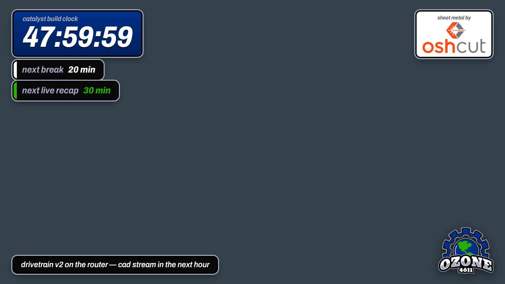

# catalyst



OBS stream overlay for FRC 4611 Ozone Robotics' FTC RI48H build, "Catalyst" — a 48-hour build
clock, cues that put themselves on screen when their moment comes near ("next break in 20 min"),
a sponsor block and the team mark. runs on cloudflare workers.

a Worker plus one Durable Object holds the state, and every open tab (OBS browser source,
operator panel, anyone's phone) keeps a hibernating websocket to it, so an edit is on screen in
roughly one RTT.

```
bun install
bun run dev                  # http://localhost:8787 — local DO, no network needed
bun run deploy
bunx wrangler secret put CONTROL_KEY
```

## routes

| path | what |
| --- | --- |
| `/` | overlay — transparent, 1920x1080 stage, auto-scales to the browser source |
| `/control?key=…` | operator panel; the key is cached in localStorage so the dock URL can be bookmarked |
| `/ws` | state socket. no key = read-only |
| `/state` | `GET` current, `POST` a partial state (deep-merged, arrays replace) |

static files come from the assets binding (`public/`), the Worker only handles `/ws` and
`/state`, so the overlay html, logos and fonts are served from cache at the edge.

## before you go live

set `CONTROL_KEY` as a secret (locally, copy `.dev.vars.example` to `.dev.vars`). **with no secret set, every visitor is an operator** — that's
deliberate for `wrangler dev`, and a bad time if someone finds the URL during a stream.

```bash
bunx wrangler secret put CONTROL_KEY
```

`/state` POSTs need `?key=…` or an `x-control-key` header; a websocket without the key is
tagged `view` and its frames get dropped server-side.

worth putting it on a subdomain you already own (route `catalyst.dunkirk.sh/*`) so the OBS
source URL is memorable at 4am.

## obs wiring

1. **Sources → + → Browser**, URL `https://catalyst.<your-domain>/`, 1920x1080, leave
   "shutdown when not visible" off.
2. **Docks → Custom Browser Docks**, URL `https://catalyst.<your-domain>/control?key=…`.

## clock

`load` parks a duration, `start` stamps an absolute `endsAt`. the countdown is derived from
that timestamp on every frame, so a refreshed browser source, an OBS restart, or a laptop
reboot all pick up exactly where the clock actually is. `pause` folds the remainder back into
state. ± shifts whichever of the two is live. **end at** takes the other road: pick a wall clock
date and time, and the clock starts and runs down to exactly that moment. the field prefills with
wherever the clock currently lands, so it doubles as a readout.

## cues

a cue is one thing that happens at a moment. that's the whole model — what's on screen is
derived from it, never toggled by hand.

| field | what |
| --- | --- |
| **when** | a date and time picker — the cue's moment, however many days out. empty for no countdown |
| **shortcut** | types the moment in a hurry: `20` (in 20 min), `1h30`, `2:15am`, `14:30`, `now`. commits on enter and empties itself, so the picker stays the only readout |
| **every** | repeat, or `once` |
| **show _n_ ahead** | it appears this long before its moment. `show always` for the old behaviour |
| **off / auto / on** | never on screen / on its own schedule / pinned until you say otherwise |
| **callout / banner** | the stacked chips under the clock, or the bar across the bottom |

so the 3am path is still two keystrokes — type `20` in a break cue's shortcut box, hit enter —
but the whole weekend can be booked before the stream starts. set saturday's inspection to `show
60m ahead` and it surfaces an hour out on its own, then retires two minutes after it lapses.

callouts render as "next break in 20 min" — `45s` / `20 min` / `1h 05m` / `3d 4h` / `now`,
blinking under a minute. one banner shows at a time, the first one live.

none of it needs a server tick or an alarm. a repeating cue's target is `at + k·every`, a pure
function of the stored state, and visibility is a pure function of that target, so a tab waking
from hibernation lands on the same second as every other tab. `public/cue.js` holds that
derivation and both pages import it, so the overlay and the panel cannot disagree about what's
on screen — the panel's top line is the same computation the overlay renders.

every broadcast carries the DO's `Date.now()`, and clients keep a skew offset from it. a phone
with a wrong clock setting a break for "in 20 min" still lands on the right second on stream.

## state api

```bash
K=your-key
curl -X POST "https://catalyst.example/state?key=$K" -d '{"show":{"timer":false,"logo":false},"sponsor":{"visible":false}}'
curl https://catalyst.example/state
```

`cues` is an array, so it replaces wholesale — read `/state` first, edit, post it back. good
enough to drive from a stream deck without opening the panel. state saved by an older build
(`chips` plus a separate `ticker`) migrates to cues on first read.

## if the venue wifi dies

`bun run dev` is the same worker against a local durable object, so the whole thing runs off
the build laptop with no uplink. point the browser source at `http://localhost:8787/` and
nothing else changes.

## cost

one DO instance, sqlite-backed (the class kind the free plan allows). websocket hibernation
means no duration billing while nobody's touching the panel, and a 48-hour show is a few
thousand requests. it fits in the free tier.

## swapping assets

`public/assets/` — `oshcut.png` (sponsor, 240px wide on screen), `ozone-logo.png` (corner,
210px); `ozone-gear.png` and `ozone-wordmark-white.png` are spares. palette is sampled off the
team logo and sits at the top of `public/index.html`: navy `#003087`, silver `#a5a8bc`,
green `#25b001`.

MIT. the Ozone 4611 and OshCut marks in `public/assets/` are their owners' and aren't covered
by it.
